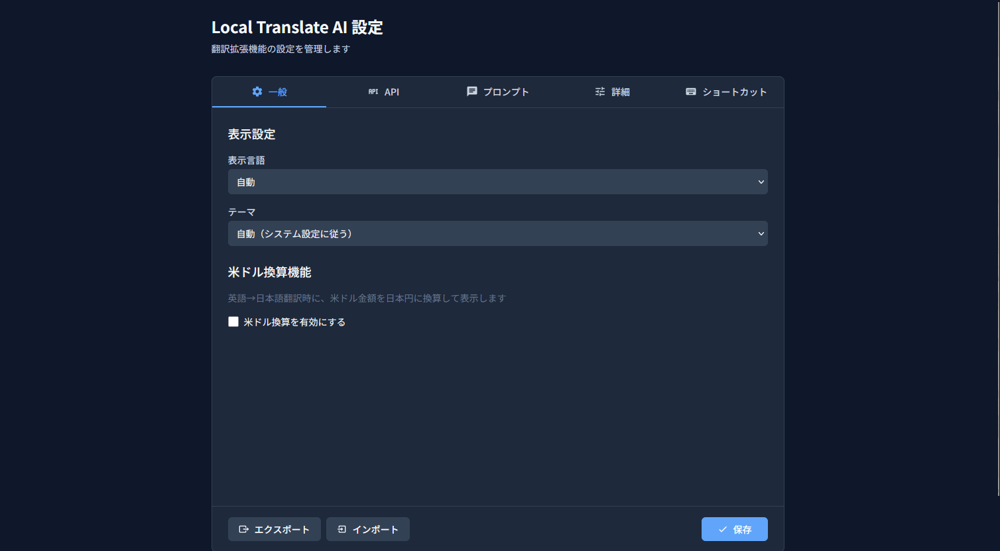

# Local Translate AI

llama.cppでホストしたローカルLLMを使用して翻訳を行うFirefox拡張機能です。OpenAI互換APIに対応しています。



イメージギャラリー : [Image Gallery](./images/gallery.md)

## 機能

- 🔤 **テキスト選択翻訳**: テキストを選択すると翻訳ボタンが表示され、ワンクリックで翻訳
- 📄 **ページ全体翻訳**: 右クリックメニューからページ全体を翻訳
- 📝 **サイドバー翻訳**: サイドバーからテキストを入力して翻訳
- ⚡ **ストリーミング対応**: 長文でも逐次表示で快適に翻訳結果を確認
- 📚 **翻訳履歴**: 過去の翻訳を保存・再利用
- 🎨 **ダークモード対応**: システム設定に連動したテーマ切り替え
- ⌨️ **キーボードショートカット**: Alt+W で選択テキストをクイック翻訳
- ⌨️ **キーボードショートカット**: Alt+Q でサイドバー表示/非表示切り替え

## 必要環境(使用時)

- Firefox 142.0 以上
- llama.cpp サーバー (OpenAI互換API)

## 必要環境(上記に加えて開発時に必要)

- Node.js 20.0.0 以上
- pnpm (corepack経由で有効化)

## インストール

[リリースページ](https://github.com/roflsunriz/local-translate-ai/releases)からインストール

Firefoxのメニューを開き、「拡張機能とテーマ」を選び、ギア（⚙）アイコンをクリック。「ファイルからアドオンをインストール」でダウンロードした`.xpi`ファイルを選択してインストール。

### 開発環境のセットアップ

```bash
# corepackを有効化
corepack enable

# 依存関係をインストール
pnpm install

# 開発ビルド（ウォッチモード）
pnpm dev

# 本番ビルド
pnpm build
```

### Firefoxへのインストール（開発用）

```bash
# web-extでFirefoxを起動
pnpm preview
```

または、`about:debugging` → `このFirefox` → `一時的なアドオンを読み込む` から `dist/manifest.json` を選択。

## llama.cppのセットアップ概要

詳細な手順は [llama-cpp.md](./llama-cpp.md) を参照してください。ここでは最小限の流れだけ記載します。

1. [llama.cppのReleases](https://github.com/ggml-org/llama.cpp/releases) からお使いの環境に合ったアーカイブをダウンロードし、展開して `llama-server` (Windowsは `llama-server.exe`) を取得する。GPU利用時はCUDA対応ビルドを選択。
2. 展開先直下に `models` ディレクトリを作成し、Hugging Face Hub から `plamo-2-translate.Q4_K_M.gguf` を配置する。
3. 以下のようにサーバーを起動する（ポートやパスは環境に合わせて調整）。
   ```bash
   # macOS / Linux / Windows(ビルドした場合)
   ./llama-server -m ./models/plamo-2-translate.Q4_K_M.gguf --port 3002 --host 0.0.0.0 -c 4096
   # Windowsで配布バイナリを利用する場合の一例（modelsを上の階層に置いた場合）
   ./llama-server.exe -m ../models/plamo-2-translate.Q4_K_M.gguf --port 3002 --host 0.0.0.0 -c 4096
   ```
4. 拡張機能の設定でAPIエンドポイントを `http://localhost:3002/v1/chat/completions` に設定し、モデル名に `plamo-2-translate-gguf` を指定する。

## 設定

### デフォルト設定

| 項目 | デフォルト値 | 備考 |
|------|-------------|------|
| APIエンドポイント | `http://localhost:3002/v1/chat/completions` | OpenRouterやCerebrasなどのOpenAI互換APIを使用できます。 |
| APIキー | `test` | ローカルではAPIキーは不要ですが、クラウド翻訳する場合は必須です。 |
| モデル | `plamo-2-translate-gguf` | 翻訳モデルの名前を設定します。llama.cppの名前と合わせてください。クラウド翻訳する場合はモデル名の指定を行います。例:`tngtech/deepseek-r1t2-chimera:free`や`zai-glm-4.6`など |
| タイムアウト | 600秒 | デフォルトは10分で中止。 |
| ソース言語 | 自動検出 | 翻訳元の言語です。 |
| ターゲット言語 | Japanese | 翻訳先言語です。 |
| システムプロンプト | 省略 | AIモデルに設定する役割を指定してください。デフォルトではテクノロジー専門家です。 |
| ユーザープロンプトテンプレート | 省略 | デフォルトではPLaMo専用テンプレートが指定されています。 |

### llama.cppサーバーの起動例

```bash
# PLaMo-2-Translateモデルを使用する場合
./llama-server -m plamo-2-translate.gguf --port 3002 --host 0.0.0.0
```

## 開発

### コマンド一覧

```bash
# 開発ビルド（ウォッチモード）
pnpm dev

# 本番ビルド
pnpm build

# Firefoxでプレビュー
pnpm preview

# リント
pnpm lint

# 型チェック
pnpm type-check

# テスト
pnpm test
```

### ディレクトリ構成

```
src/
├── background/     # Background Script
├── components/     # 共通Reactコンポーネント
├── content/        # Content Script
├── hooks/          # カスタムフック
├── i18n/           # 国際化リソース
├── options/        # 設定画面UI（React）
├── services/       # API通信・ストレージ等
├── sidebar/        # サイドバーUI（React）
├── stores/         # Zustand stores
├── styles/         # グローバルCSS
├── types/          # TypeScript型定義
├── utils/          # ユーティリティ
└── vite.config.ts  # Vite設定
```

## ライセンス

MIT License

## 貢献

Issue・Pull Requestはいつでも歓迎します。

1. このリポジトリをフォーク
2. フィーチャーブランチを作成 (`git checkout -b feature/amazing-feature`)
3. 変更をコミット (`git commit -m 'Add amazing feature'`)
4. ブランチをプッシュ (`git push origin feature/amazing-feature`)
5. Pull Requestを作成

