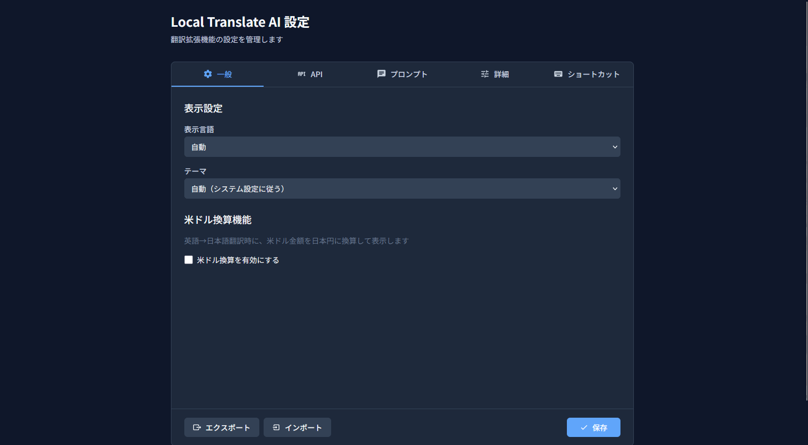

# Local Translate AI

llama.cppでホストしたローカルLLMを使用して翻訳を行うFirefox拡張機能です。OpenAI互換API、Anthropic Messages API、Google翻訳に対応しています。



イメージギャラリー: [Image Gallery](./images/gallery.md)

## 機能

- **テキスト選択翻訳**: テキストを選択すると翻訳ボタンが表示され、ワンクリックで翻訳
- **ページ全体翻訳**: 右クリックメニューからページ全体を翻訳
- **ページ翻訳の並列化**: APIプロファイルごとに1～32件の同時リクエスト数を設定可能（既定値1）
- **サイドバー翻訳**: サイドバーからテキストを入力して翻訳
- **ストリーミング対応**: 長文でも逐次表示で快適に翻訳結果を確認
- **翻訳履歴**: 過去の翻訳を保存・再利用（設定画面・サイドバーから確認可能）
- **ダークモード対応**: システム設定に連動したテーマ切り替え
- **キーボードショートカット**: Alt+W で選択テキストをクイック翻訳
- **キーボードショートカット**: Alt+Q でサイドバー表示/非表示切り替え
- **ポップアップウィンドウ**: ドラッグ移動可能、デフォルトでは閉じるボタン以外では閉じない設計（設定で外部クリックでも閉じるように変更可能）
- **Google翻訳モード**: トグルスイッチでGoogle翻訳に切り替え可能（APIキー不要、LLMサーバー不要）

## 必要環境(使用時)

- Firefox 142.0 以上
- llama.cpp サーバー (OpenAI互換API) ※Google翻訳モード使用時は不要

## インストール

[Mozilla Add-ons](https://addons.mozilla.org/ja/firefox/addon/local-translate-ai/)からインストール

[リリースページ](https://github.com/roflsunriz/local-translate-ai/releases)からインストール

Firefoxのメニューから「拡張機能とテーマ」を開き、ギア（⚙）アイコンをクリックします。「ファイルからアドオンをインストール」で、ダウンロードした`.xpi`ファイルを選択します。

## llama.cppのセットアップ概要

詳細な手順は [llama-cpp.md](./llama-cpp.md) を参照してください。ここでは最小限の流れだけ記載します。

1. [llama.cppのReleases](https://github.com/ggml-org/llama.cpp/releases) からお使いの環境に合ったアーカイブをダウンロードし、展開して `llama-server` (Windowsは `llama-server.exe`) を取得する。GPU利用時はCUDA対応ビルドを選択。
2. 展開先直下に `models` ディレクトリを作成し、[PLaMo 3 Translate 2B GGUF](https://huggingface.co/pfnet/plamo-3-translate-2b-GGUF) の `plamo-3-translate-2b-Q4_K_M.gguf` を配置する。モデルの利用条件は[公式ライセンス](https://plamo.preferredai.jp/info/plamo-community-license-ja)を確認する。
3. 以下のようにサーバーを起動する（ポートやパスは環境に合わせて調整）。
   ```bash
   # macOS / Linux / Windows(ビルドした場合)
   ./llama-server -m ./models/plamo-3-translate-2b-Q4_K_M.gguf --port 3002 --host 127.0.0.1 -c 16384 --alias plamo-3-translate --jinja --no-prefill-assistant
   # Windowsで配布バイナリを利用する場合の一例（modelsを上の階層に置いた場合）
   ./llama-server.exe -m ../models/plamo-3-translate-2b-Q4_K_M.gguf --port 3002 --host 127.0.0.1 -c 16384 --alias plamo-3-translate --jinja --no-prefill-assistant
   ```
4. 新規インストールでは既定のAPI種別・エンドポイント・モデル名のまま使用する。既存利用者は設定 > APIで新しいプロファイルを作成するか、対象プロファイルのAPI種別を `PLaMo 3 Translate (llama.cpp)`、エンドポイントを `http://localhost:3002/v1/chat/completions`、モデル名を `plamo-3-translate` に設定する。

既存プロファイルは更新時に変更されません。PLaMo 2を使い続ける場合は従来の設定を保持してください。PLaMo 3では原文と言語設定を使い、従来のシステム・ユーザープロンプトは使いません。設定 > プロンプトで日本語の文体を選べます。中国語は簡体字として扱い、ポルトガル語はモデルの公式対応言語に含まれません。

## 設定

### デフォルト設定

| 項目 | デフォルト値 | 備考 |
|------|-------------|------|
| API種別 | PLaMo 3 Translate (llama.cpp) | PLaMo 2や他のOpenAI互換API、Anthropic Messages APIを使う場合は切り替えてください。 |
| APIエンドポイント | `http://localhost:3002/v1/chat/completions` | OpenRouterやCerebrasなどのOpenAI互換APIを使用できます。 |
| APIキー | `test` | ローカルではAPIキーは不要ですが、クラウド翻訳する場合は必須です。 |
| モデル | `plamo-3-translate` | サーバーの `--alias` または利用するAPIのモデル名と合わせてください。 |
| タイムアウト | 600秒 | デフォルトは10分で中止。 |
| ページ翻訳の同時リクエスト数 | 1 | 1～32。APIサーバーの並列slot数やプロバイダーのレート制限に合わせて設定します。 |
| ソース言語 | 自動検出 | 翻訳元の言語です。 |
| ターゲット言語 | Japanese | 翻訳先言語です。 |
| 日本語の文体 | 常体 | PLaMo 3で日本語へ翻訳する場合に適用します。敬体またはモデルの既定も選べます。 |
| システム／ユーザープロンプト | PLaMo 3では不使用 | OpenAI互換・Anthropicのプロファイルでは従来どおり設定できます。 |

### llama.cppサーバーの起動例

```bash
# PLaMo 3 Translate 2Bモデルを使用する場合
./llama-server -m ./models/plamo-3-translate-2b-Q4_K_M.gguf --port 3002 --host 127.0.0.1 -c 16384 --alias plamo-3-translate --jinja --no-prefill-assistant
```

ページ翻訳を並列化する場合は、llama.cpp側でも同数以上のslotを用意します。例えば4件を同時処理する場合は `--parallel 4` を付け、設定 > API > 対象プロファイルの「ページ翻訳の同時リクエスト数」も4にします。並列数を増やすとKVキャッシュなどのメモリー使用量も増えるため、まず2～4で実測してください。

OpenAI互換APIという形式だけでは、サーバーが同時推論するか、内部キューで順次処理するかは決まりません。llama.cpp、Ollama、LM Studio、LocalAI、vLLMとクラウドAPIの違いは [ページ翻訳の同時リクエスト仕様](./docs/PAGE_TRANSLATION_CONCURRENCY.md) を参照してください。

### Anthropic Messages APIを使う場合

1. 設定 > API で「API種別」を「Anthropic Messages API」に変更する
2. APIエンドポイントを `https://api.anthropic.com/v1/messages` に設定する
3. AnthropicのAPIキーを入力する
4. [公式モデル一覧](https://platform.claude.com/docs/en/models/overview)で利用したいモデルの「Claude API ID」を確認し、モデル名に指定する

### Google翻訳を使う場合

LLMサーバーを起動せずに翻訳したい場合、Google翻訳モードを利用できます。

1. サイドバーの「Google翻訳を使う」トグルをONにする、または設定 > 一般 > 「Google翻訳」セクションでトグルをONにする
2. APIキーやサーバーの設定は不要。すぐに翻訳が利用可能
3. テキスト選択翻訳、サイドバー翻訳、ページ全体翻訳の全てでGoogle翻訳が使用される

## 開発

Node.js 20以上とBunを用意し、`bun install --frozen-lockfile` で依存関係を導入します。`bun run build` で `dist/` を生成します。開発時の起動・テストは[テスト手順](./docs/TESTING.md)、リリースは[更新手順](./how-to-update.md)を参照してください。

## ライセンス

MIT License

## 貢献

Issue・Pull Requestはいつでも歓迎します。

1. このリポジトリをフォーク
2. フィーチャーブランチを作成 (`git checkout -b feature/amazing-feature`)
3. 変更をコミット (`git commit -m 'Add amazing feature'`)
4. ブランチをプッシュ (`git push origin feature/amazing-feature`)
5. Pull Requestを作成

## 依存更新の自動処理

Dependabotの更新確認とマージは毎月28日（日本時間）にまとめます。詳細は[更新手順](./how-to-update.md)を参照してください。
